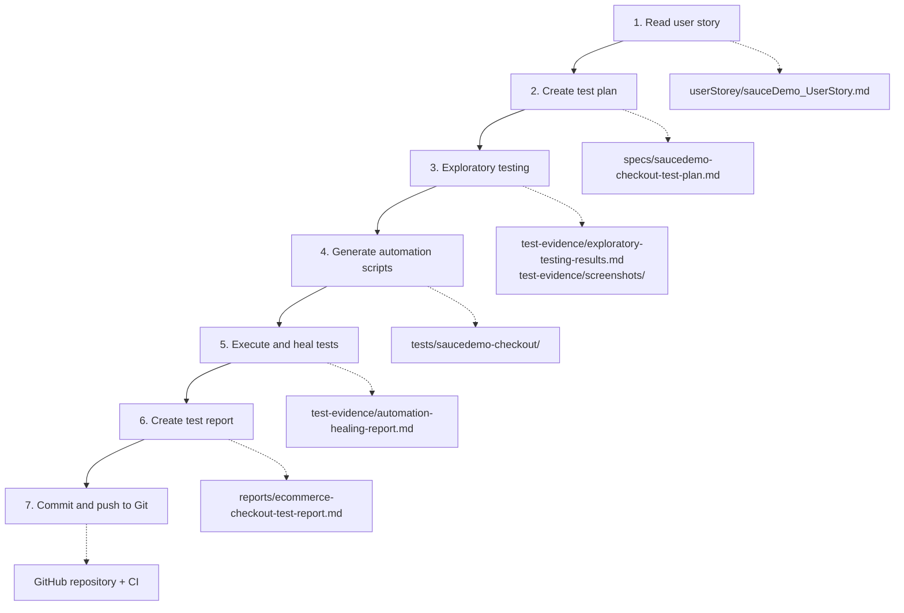

# Ecommerce E2E Workflow with Playwright AI Agents

An end-to-end QA workflow for an e-commerce checkout, driven by natural-language prompts to AI agents. Starting from a single user story, the workflow produces a test plan, exploratory test evidence, an automated Playwright suite, a healing log, a test report and a Git commit.

The application under test is [SauceDemo](https://www.saucedemo.com), a public demo store.

## Results at a glance

| Item | Result |
|---|---|
| User story | SCRUM-101 – Saucedemo checkout process, 5 acceptance criteria |
| Test cases planned and executed | 38 |
| Passed / failed | 28 / 10 |
| Application defects found | 8 (4 High, 4 Medium) |
| Automation scripts healed | 1 (TC-24) |
| Flaky tests | 0 (28 passing tests × 3 repeats) |

All 10 failures are real application defects, not test problems. The full analysis is in the [test execution report](reports/ecommerce-checkout-test-report.md).

## The QA workflow

The workflow has seven steps. Each step is one natural-language prompt, and each step's output is the next step's input.



| Step | What happens | Agent role | Output |
|---|---|---|---|
| 1. Read user story | Summarise requirements, acceptance criteria, URL and credentials | – | Summary in chat |
| 2. Create test plan | Explore the live site, then write scenarios for every acceptance criterion: happy path, negative, boundary, navigation and UI checks | Planner | [Test plan](specs/saucedemo-checkout-test-plan.md) |
| 3. Exploratory testing | Execute every scenario in a real browser at 1280x720, record expected versus actual per step, capture screenshots | – | [Exploratory results](test-evidence/exploratory-testing-results.md), [screenshots](test-evidence/screenshots/) |
| 4. Generate scripts | Turn the plan into Playwright tests, reusing the selectors and UI quirks found in step 3 | Generator | [Test suites](tests/saucedemo-checkout/) |
| 5. Execute and heal | Run the suite, fix script faults (up to 3 attempts per test), and tag real defects without weakening their assertions | Healer | [Healing report](test-evidence/automation-healing-report.md) |
| 6. Create report | Compile manual results, automation results, defects and coverage | – | [Test report](reports/ecommerce-checkout-test-report.md) |
| 7. Commit to Git | Stage everything except ignored output, commit, push | – | This repository |

### Rules the workflow follows

- **Tests are written to the acceptance criteria, not to the application.** Where the site does not meet a criterion, the test fails and stays failing.
- **Healing fixes scripts, never assertions.** A selector or timing fault is healed; an application defect is tagged `@defect` and logged.
- **Exploration feeds automation.** Selectors, wait strategies and UI quirks come from step 3, not guesswork.
- **Chrome only**, at a fixed 1280x720 viewport, as the user story requires.

### How this run was executed

The repository defines three Playwright agents for GitHub Copilot (planner, generator, healer) in [.github/agents/](.github/agents/), backed by the Playwright test MCP server configured in [.vscode/mcp.json](.vscode/mcp.json).

For the committed run, the prompts were executed by Claude Code, which followed each agent's instructions but drove the browser through the Playwright library and used the `git` CLI, because the MCP servers were not connected in that session. Two consequences are worth knowing:

- The "manual" exploratory round was script-driven in a real browser, not hands-on clicking.
- Testing used Playwright's bundled Chromium, not branded Google Chrome.

## Project architecture

```
.
├── .github/
│   ├── agents/                        # AI agent definitions (planner, generator, healer)
│   └── workflows/
│       ├── playwright.yml             # CI: runs the test suite on push and pull request
│       └── copilot-setup-steps.yml    # Environment setup for the Copilot coding agent
├── .vscode/mcp.json                   # Playwright test MCP server configuration
├── userStorey/
│   └── sauceDemo_UserStory.md         # Step 1 input: the user story
├── specs/
│   └── saucedemo-checkout-test-plan.md    # Step 2: test plan, 38 test cases
├── test-evidence/
│   ├── exploratory-testing-results.md     # Step 3: per-step results
│   ├── screenshots/                       # Step 3: 34 screenshots
│   └── automation-healing-report.md       # Step 5: run history and healing log
├── tests/saucedemo-checkout/          # Step 4: automated suite
│   ├── helpers.js                     # Shared test data and flow helpers
│   ├── cart-review.spec.js            # TC-01 to TC-06  (AC1)
│   ├── checkout-information.spec.js   # TC-07 to TC-14  (AC2)
│   ├── input-validation.spec.js       # TC-15 to TC-22  (AC5)
│   ├── order-overview.spec.js         # TC-23 to TC-28  (AC3)
│   ├── order-completion.spec.js       # TC-29, TC-30    (AC4)
│   ├── access-control.spec.js         # TC-31 to TC-33  (business rules)
│   └── navigation.spec.js             # TC-34 to TC-38  (navigation, back button)
├── tests/seed.spec.ts                 # Seed test: logs in and lands on Products
├── reports/
│   └── ecommerce-checkout-test-report.md  # Step 6: final report
├── playwright.config.js               # Playwright configuration
└── package.json
```

### Test suite design

- **One spec file per test plan section.** Test titles carry the plan's IDs (`TC-01: …`), so a failing test maps straight back to the plan and the report.
- **`helpers.js` holds what the suites share:** products and prices, valid checkout data, page titles and URL patterns, and flow helpers such as `login`, `addToCart`, `startCheckout` and `goToOverview`.
- **Hooks:** `beforeEach` logs in and sets up the starting state; `afterEach` attaches the final URL when a test fails.
- **Selectors:** `data-test` attributes throughout, via `testIdAttribute: 'data-test'` and `page.getByTestId()`.
- **Waits:** web-first assertions only, with no fixed timeouts. SauceDemo is a single-page app whose URL changes before the new page renders, so helpers wait on the page title.
- **Defect tests** are marked with the `knownDefect(id, description)` helper, which adds a `@defect` tag and an `issue` annotation carrying the bug ID.

### Configuration

[playwright.config.js](playwright.config.js) defines a single `chromium` project using the Desktop Chrome profile at 1280x720, with `baseURL` set to the SauceDemo site. Screenshots and traces are kept for failed tests. Tests run fully in parallel on 4 workers with no retries.

## Getting started

### Prerequisites

- Node.js (LTS)
- Git

### Install

```bash
git clone https://github.com/Hemalatha-MD/Ecommerce-E2E-Workflow-with-Playwright-AI-Agents.git
cd Ecommerce-E2E-Workflow-with-Playwright-AI-Agents
npm ci
npx playwright install chromium
```

### Run the tests

| Purpose | Command |
|---|---|
| Full suite | `npx playwright test tests/saucedemo-checkout --project=chromium` |
| Tests expected to pass (regression gate) | `npm run test:stable` |
| Known-defect tests only | `npm run test:defects` |
| One suite | `npx playwright test tests/saucedemo-checkout/cart-review.spec.js --project=chromium` |
| One test case | `npx playwright test --project=chromium -g "TC-29"` |
| Headed, to watch the browser | add `--headed` |
| Open the HTML report | `npm run report` |

The full suite exits with a failure code, because the 10 defect tests fail by design. Use `npm run test:stable` when you need a green run.

Test credentials are SauceDemo's public demo account (`standard_user` / `secret_sauce`), so no secrets are needed.

## Test coverage

| Requirement | Test cases | Verdict |
|---|---|---|
| AC1 – Cart review | TC-01 to TC-06, TC-29, TC-30, TC-36, TC-37 | Partly met |
| AC2 – Checkout information entry | TC-07 to TC-14, TC-18, TC-30, TC-31, TC-34, TC-35 | Partly met |
| AC3 – Order overview | TC-22 to TC-29, TC-31, TC-35, TC-37 | Met |
| AC4 – Order completion | TC-29, TC-35, TC-38 | Met |
| AC5 – Error handling | TC-14 to TC-22 | Not met |
| Rule: login required for checkout | TC-32, TC-33 | Met |
| Rule: order confirmation clears the cart | TC-29, TC-38 | Met |

## Defects found

| ID | Severity | Summary | Tests |
|---|---|---|---|
| BUG-01 | Medium | Cart page does not show a total price | TC-03 |
| BUG-02 | High | Name fields accept special characters, digits and script tags | TC-15, TC-16, TC-19 |
| BUG-03 | Medium | Zip/Postal Code accepts any text | TC-17 |
| BUG-04 | High | Whitespace-only values pass the mandatory-field check | TC-18 |
| BUG-05 | Medium | Pressing Enter in the form cancels checkout | TC-22 |
| BUG-06 | High | Checkout can be completed with an empty cart | TC-30 |
| BUG-07 | High | Checkout information step can be bypassed by URL | TC-31 |
| BUG-08 | Medium | Back button after an order shows a submittable empty order | TC-35 |

Steps to reproduce, expected versus actual behaviour and screenshots for each are in the [defects log](reports/ecommerce-checkout-test-report.md#4-defects-log). BUG-01 and BUG-03 depend on how the story is read and need product owner confirmation.

## Continuous integration

[.github/workflows/playwright.yml](.github/workflows/playwright.yml) runs on every push and pull request to `main`:

1. Install dependencies and Chromium.
2. Run every test not tagged `@defect`. This is the regression gate and must pass.
3. Run the `@defect` tests with `continue-on-error`, so known defects are reported without failing the build.
4. Upload the HTML report as a build artifact.

When a defect is fixed, its test starts passing; remove the `knownDefect(...)` marker so the test joins the regression gate.

## Running the workflow yourself

To repeat the workflow for another user story with GitHub Copilot in VS Code:

1. Open the repository in VS Code. The Playwright test MCP server starts from `.vscode/mcp.json`.
2. Add your user story as a markdown file with the application URL, test credentials and acceptance criteria.
3. Run the seven prompts in order, naming the matching agent for steps 2, 4 and 5 (`playwright-test-planner`, `playwright-test-generator`, `playwright-test-healer`).
4. Review each step's output before starting the next; the plan and the exploratory results drive everything after them.

## Tech stack

- [Playwright Test](https://playwright.dev) 1.63 (JavaScript)
- Node.js
- GitHub Actions
- Playwright test agents (planner, generator, healer) over the Model Context Protocol
